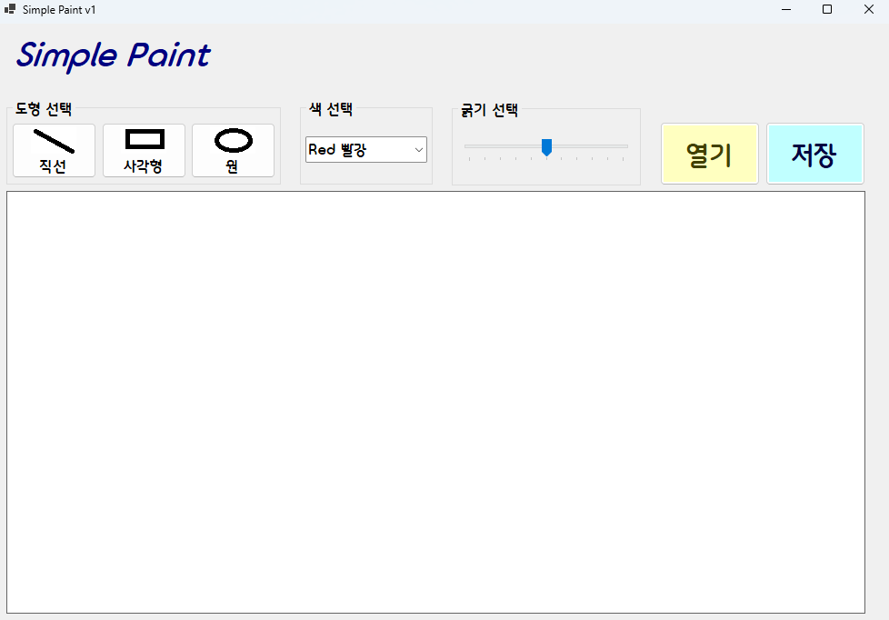
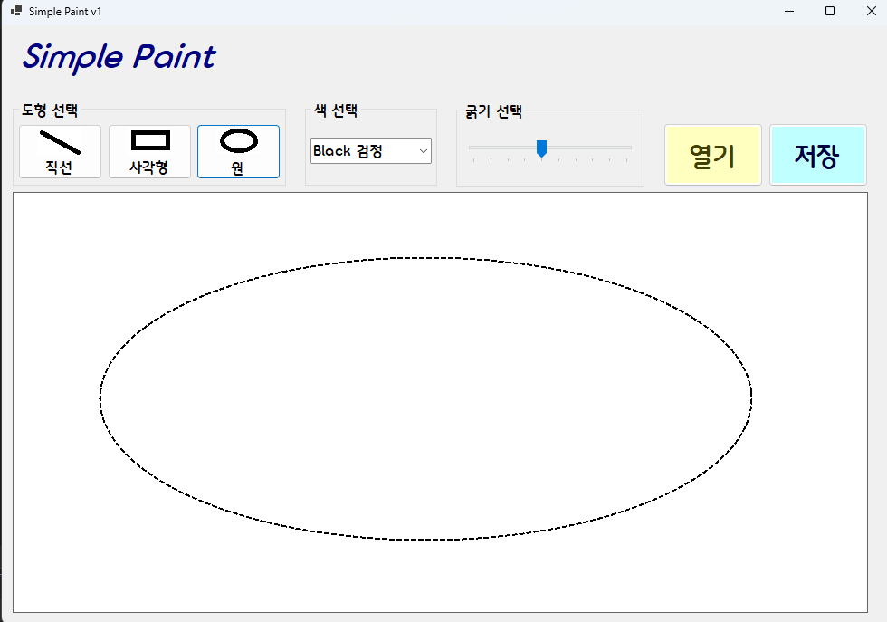
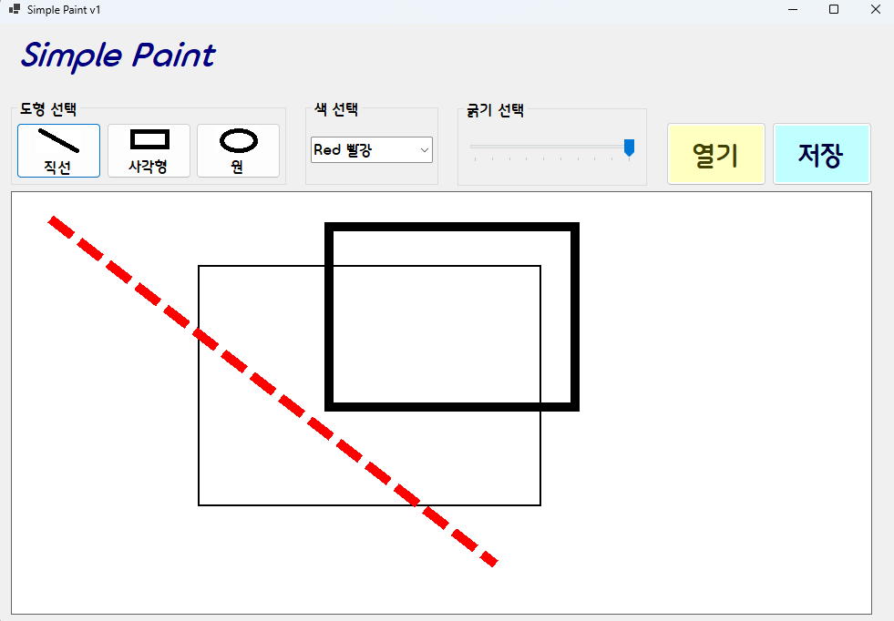
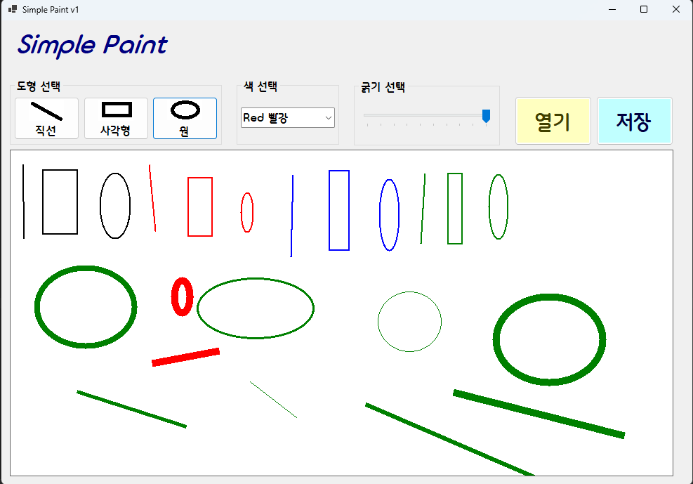
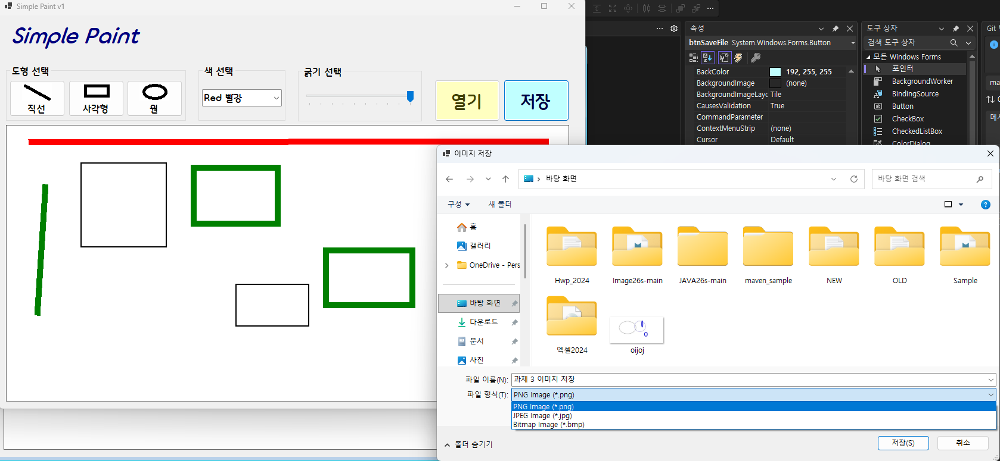
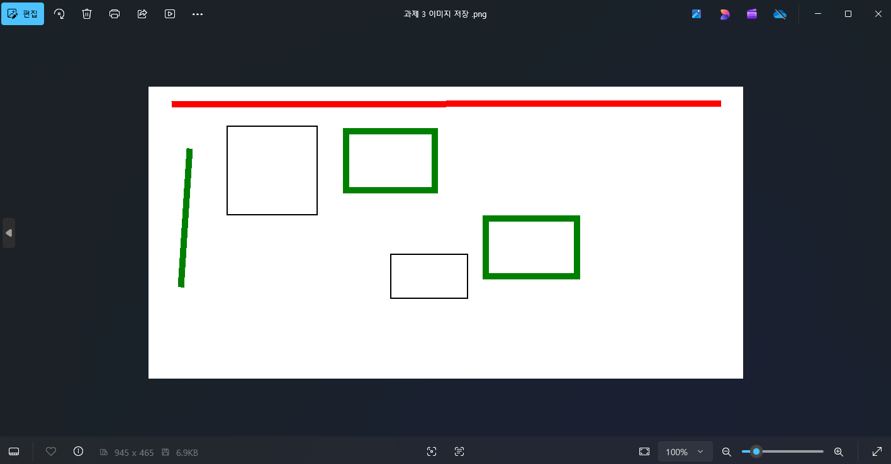
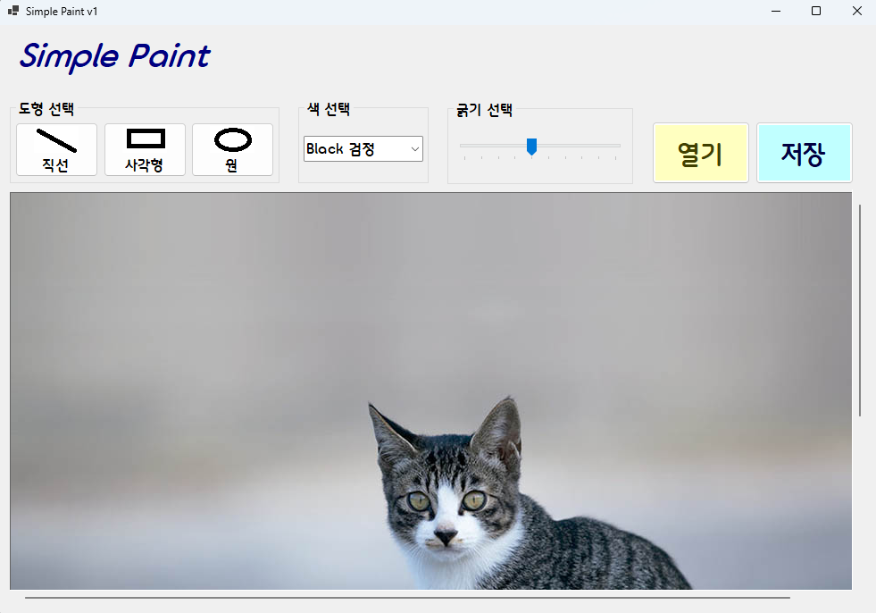
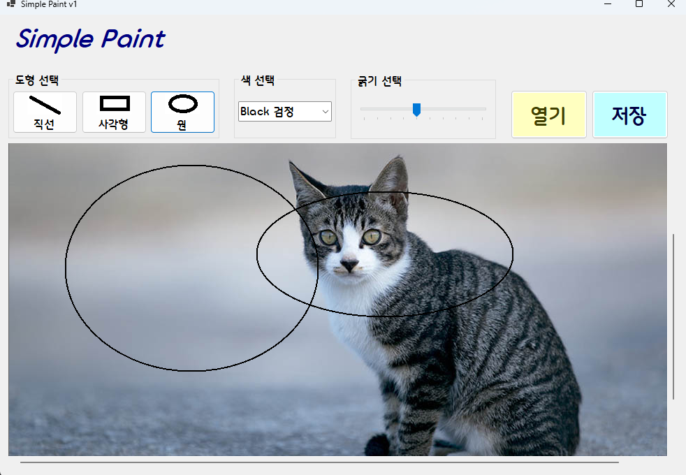
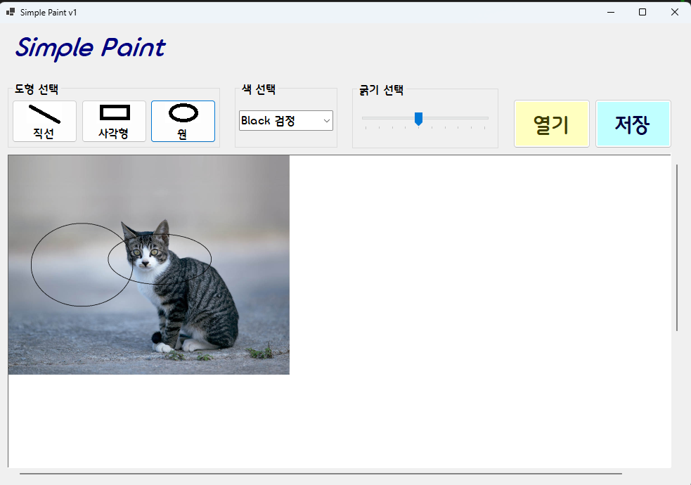
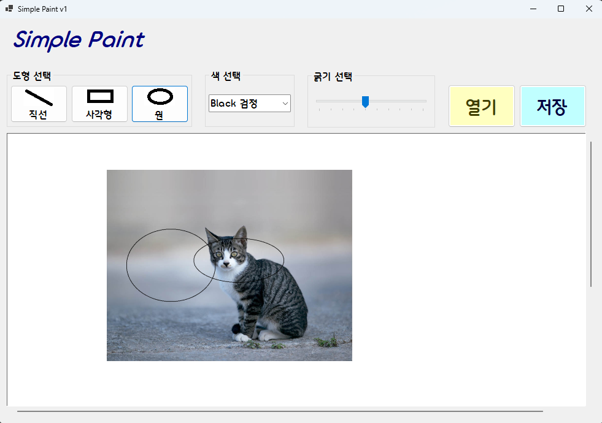

# (C# 코딩) SimplePaint

## 개요

- C# 프로그래밍 학습
- 1줄 소개: 도형을 선택하여 캔버스에 그릴 수 있는 간단한 그림판 앱

- 사용한 플랫폼:
  - C#, .NET Windows Forms, Visual Studio, GitHub

- 사용한 컨트롤:
  - Label, Button, ComboBox, PictureBox, GroupBox, TrackBar

- 사용한 기술과 구현한 기능:
  - Visual Studio를 이용하여 UI 디자인
  - Bitmap 기반 캔버스를 이용하고 마우스이벤트 기반의 도형 그리기 방법을 구현
  - 도형 선택 기능 구현 (직선, 사각형, 원)
  - 색 선택 기능 구현 (검정, 빨강, 파랑, 녹색)
  - 선의 굵기 선택 기능 구현 (트랙 바를 통해 구현)
  - 캔버스를 준비하고 (이미지파일 사용가능) 그위에 그림을 그리고 그 결과를 이미지 파일로 변환
  - 변환한 파일을 저장하는 기능 구현

## 실행 화면 (과제1)
- 코드의 실행 스크린샷과 구현 내용 설명

- 구현한 내용 (위 그림 참조)
  - UI 구성 : 라벨, 도형선택 버튼, 색 선택, 굵기 선택, 캔버스 구성
  - 도형 선택 : 직선, 사각형, 원 중에 선택할 수 있도록 구성
  - 색 선택 : 빨강, 노랑, 파랑 중에 선택할 수 있도록 구성
  - 굵기 선택 : 선의 굵기를 선택할 수 있도록 구성
  - 캔버스 : PictureBox 컨트롤을 이용하여 그림을 그릴 수 있는 영역 구성

## 실행 화면 (과제2)
- 코드의 실행 스크린샷과 구현 내용 설명

- 구현한 내용 (위 그림 참조)
  - 마우스 드래그를 이용한 그림 그리기 기능 구현
  - 직선, 사각형, 원 그리기 기능 구현
  - 그리기 결과를 Bitmap으로 변환하여 PictureBox에 표시
  - 색 선택 기능 구현 ( 검정, 빨강, 파랑, 녹색 ) 
  - 선의 굵기 선택 기능 구현 (트랙 바를 통해 구현 )

## 실행 화면 (과제3)
- 코드의 실행 스크린샷과 구현 내용 설명

- 구현한 내용 (위 그림 참조)
  - 저장 버튼 클릭시 현재 캔버스에 그려진 그림을 Bitmap으로 변환하여 파일로 저장하는 기능 구현
  - 저장하는 이미지 파일의 종류를 선택할 수 있도록 구성 (PNG, JPEG, BMP)
  - 저장된 이미지 파일이 정상적으로 저장되고 열리는지 확인
  - 저장된 이미지 파일이 캔버스에 그려진 그림과 일치하는지 확인
  - 파일 저장을 위한 대화상자인 SaveFileDialog 사용

## 실행 화면 (과제4)
- 코드의 실행 스크린샷과 구현 내용 설명

- 구현한 내용 (위 그림 참조)
  - 열기 버튼을 통해 이미지를 불러와 캔버스로 사용하는 기능 구현 
  - 열기 버튼 클릭시 파일 대화상자인 OpenFileDialog를 통해 이미지 파일 선택
  - 선택한 이미지 파일이 캔버스에 정상적으로 표시되는지 확인
  - 불러온 이미지 위에 도형을 그리는 기능 구현
  - 불러온 이미지의 확대, 축소 기능과 이동 기능 구현
  - 불러온 이미지가 클경우 스크롤바가 생기도록 구현 